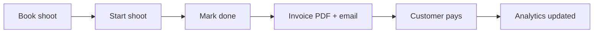

# Matt Invoice Assistant

A photographer workflow app for **Matt** — manage shoots, send invoices, collect payments, and keep clients in the loop without juggling spreadsheets and email threads.

Matt signs in to a private dashboard, sees upcoming jobs (synced from a mock Trello/Jira feed), books new shoots, moves jobs through **booked → in progress → done**, and triggers invoice delivery when a shoot wraps. Clients use a separate portal to book sessions, view invoices, pay online, and manage their account.

---

## What we built

| Area | What it does |
|------|----------------|
| **Authentication** | Separate signup/login for photographer (`/signup`, `/login`) and customers (`/customer/signup`, `/customer/login`). Session cookies, bcrypt password hashing. |
| **Mock job feed** | Pending jobs sync from `data/mock_jobs.json`, simulating Trello/Jira. Dashboard shows client, shoot title, and predetermined invoice terms. |
| **Booking** | Matt can book shoots manually (`/jobs/book`) with amount, tax, payment due date, and email template. Customers can book from their portal (`/customer/book`) using studio defaults. |
| **Job workflow** | Three states: **booked** (pending) → **in progress** (started) → **done**. Marking done is the only trigger for invoice generation and email send. |
| **Customer portal** | Dashboard with job status, invoice list, PDF download, pay flow, saved cards, and email settings. |
| **Invoice PDFs** | Generated with company letterhead (`fpdf2`), saved to `data/invoices/`, attached to outbound email. |
| **Email (Mailjet)** | Real sends via [Mailjet](https://www.mailjet.com/) when `EMAIL_MODE=mailjet`; mock mode logs to `logs/email_mock.log`. HTML + text body, PDF attachment. |
| **Payment deadlines** | Due date set at booking (or default `DEFAULT_PAYMENT_DUE_DAYS`). Overdue/due-today reminders via `scripts/send_payment_reminders.py` (cron-friendly). |
| **Resend invoice** | Matt can resend invoice email for completed jobs from the dashboard. |
| **Email delivery status** | Invoices track `email_status` (`pending`, `sent`, `delivered`, `failed`). Shown on both dashboards; customers see failed-delivery alerts. |
| **Customer email settings** | Clients can update their email at `/customer/settings` (used for future invoice delivery). |
| **Mock Stripe payments** | Card tokenization and charge simulation — Visa/Mastercard, saved payment methods, pay-with-saved-card or one-off. Card ending `0002` simulates decline. |
| **CVV not stored** | Security code is validated at payment time only; never persisted (only last4, brand, expiry, and mock token are stored). |
| **Analytics** | Revenue pipeline at `/analytics` — booked, in-progress, unpaid invoiced, and paid totals. |

End-to-end tests cover the MVP and extended features; run `./scripts/verify.sh` for the full suite.

---

## Portals

Two apps in one — same origin, different routes and roles.

| Portal | Base URL (local) | Key routes |
|--------|------------------|------------|
| **Photographer** | http://127.0.0.1:8000 | `/login`, `/signup`, `/dashboard`, `/analytics`, `/jobs/book` |
| **Customer** | http://127.0.0.1:8000/customer | `/customer/login`, `/customer/signup`, `/customer/dashboard`, `/customer/book`, `/customer/invoices/{id}/pay` |

Root `/` redirects to the photographer login page.

---

## UI reference

Screenshots of every major page and workflow state live in [`screenshots/`](screenshots/). Regenerate them with the app running:

```bash
./scripts/run.sh          # in one terminal
uv run python scripts/capture_screenshots.py   # in another
```

Examples: `photographer-dashboard.png`, `photographer-analytics.png`, `customer-pay-invoice-stripe.png`, `customer-payment-methods.png`.

---

## Tech stack

| Layer | Choice |
|-------|--------|
| Language | Python 3.12+ |
| Web framework | [FastAPI](https://fastapi.tiangolo.com/) |
| Templates | Jinja2 (server-rendered HTML) |
| Styling | Tailwind CSS (CDN) |
| Database | SQLite via SQLAlchemy 2 |
| Auth | Starlette sessions + bcrypt |
| Validation | Pydantic v2 |
| PDF | fpdf2 |
| HTTP client | httpx (Mailjet API) |
| Package manager | [uv](https://docs.astral.sh/uv/) |
| Tests | pytest, pyright, ruff |

Architecture and layer boundaries: [`docs/ARCHITECTURE.md`](docs/ARCHITECTURE.md).

---

## Getting started

### Prerequisites

- Python **3.12+**
- **uv** — `curl -LsSf https://astral.sh/uv/install.sh | sh`

### Quick init (smoke test)

```bash
./init.sh
```

Creates `.env` from `.env.example` (with a generated `SECRET_KEY`), installs dependencies, starts the app briefly, and checks `/health`.

### Run locally

```bash
./scripts/run.sh
```

Open http://127.0.0.1:8000 — you should see the photographer login page.

### Verify (typecheck, lint, tests)

```bash
./scripts/verify.sh
```

### Environment variables

Copy and edit the env file:

```bash
cp .env.example .env
```

| Variable | Required | Purpose |
|----------|----------|---------|
| `SECRET_KEY` | Yes | Session cookie signing |
| `DATABASE_URL` | Yes (default OK) | SQLite path, e.g. `sqlite:///./data/app.db` |
| `EMAIL_MODE` | No | `mock` (log only) or `mailjet` (real sends) |
| `MAILJET_API_KEY`, `MAILJET_API_SECRET` | For Mailjet | From [Mailjet API keys](https://app.mailjet.com/account/apikeys) |
| `MAILJET_FROM_EMAIL`, `MAILJET_FROM_NAME` | For Mailjet | Verified sender in Mailjet |
| `COMPANY_*` | No | Letterhead on PDFs and emails |
| `PHOTOGRAPHER_EMAIL` | No | Studio owner email (matches Matt's login) |
| `DEFAULT_SHOOT_AMOUNT_CENTS`, `DEFAULT_TAX_RATE`, `DEFAULT_PAYMENT_DUE_DAYS` | No | Customer booking defaults |
| `APP_BASE_URL` | No | Pay links in reminder emails |
| `HOST`, `PORT`, `LOG_LEVEL` | No | Server tuning |

See [`.env.example`](.env.example) for defaults and comments.

**Demo credentials** (from tests / screenshot script):

- Photographer: `matt@studio.com` / `studio123`
- Customer: `alex.client@example.com` / `clientpass123`

Operations (Mailjet setup, payment reminder cron, deployment, troubleshooting): [`docs/RUNBOOK.md`](docs/RUNBOOK.md).

---

## Workflow (Matt's day)



1. Jobs appear on the dashboard from the mock feed or manual/customer booking.
2. Matt **starts** a booked job when the shoot begins.
3. Matt **marks done** when finished — invoice is created, PDF generated, email sent.
4. Customer pays via the portal; Matt sees payment status and revenue in analytics.
5. Optional: resend invoice, payment reminders for overdue invoices.

---

## Tools & services

| Service | Use |
|---------|-----|
| [Mailjet](https://www.mailjet.com/) | Transactional invoice and payment-reminder email with PDF attachments |

Job sources (Trello/Jira) and payment processing (Stripe) are **mocked locally** for development — no live external job or charge APIs.

---

## Roadmap

Planned next steps:

- **WhatsApp / Telegram integration** — Matt sends a text or voice message to drive workflow state (e.g. “shoot done” → prompt invoice/payment flow) without opening the dashboard.
- **Speech-to-text** — Voice messages transcribed to commands; evaluating providers such as [Speechmatics pricing](https://www.speechmatics.com/pricing) for cost and accuracy.

Deferred polish (from recent sessions): custom domain + SPF/DKIM for deliverability, Reply-To header, logo on letterhead.

Feature checklist: [`specs/feature_list.json`](specs/feature_list.json).

---

## Project layout

```
app/              Routes, services, repositories, templates
data/             SQLite DB, mock jobs, generated invoice PDFs
docs/             Architecture, runbook
scripts/          run, verify, reminders, screenshot capture
tests/            pytest suite
screenshots/      UI reference images
```

---

## License

Hackathon / prototype — see repository for license terms if present.
